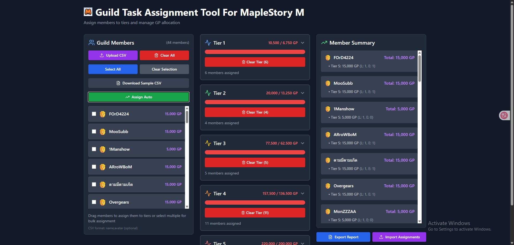

# Guild Task Assignment Tool



A web app for assigning guild members to each Tier with automatic GP calculation, built with React + Vite + TailwindCSS.

## Features

- Add/upload guild members from a CSV file
- Drag and drop members to assign them to different Tiers
- Set the number of Enhancements per member
- Automatic GP calculation and total display
- Bulk selection and assignment of multiple members at once
- Auto-assign algorithm to automatically distribute members across tiers
- Export assignment report as a CSV file
- Import assignments from previously exported CSV files
- One-click clearing of tier assignments

## Getting Started

### 1. Clone the project

```sh
git clone https://github.com/FordenHillson/guild-task-assignment.git
cd guild-task-assignment
```

### 2. Install dependencies

```sh
npm install
```

### 3. Start the development server

```sh
npm run dev
```

Open your browser at [http://localhost:5173](http://localhost:5173)

### 4. Build for production

```sh
npm run build
```

The production files will be generated in the `dist/` folder.

### 5. Example CSV file for uploading members

```csv
name,avatar
John,🧑
Jane,👩
Mike,👨
Sarah,👱
Tom,🧔
```

## Using the Tool

### Basic Usage

1. Upload or add members to the left panel
2. Select members by clicking on them
3. Either drag a member to a tier or use the bulk assignment feature
4. Adjust enhancement levels as needed

### Advanced Features

- **Auto-Assign**: Click "Assign Auto" to automatically distribute members across all tiers
- **Import/Export**: Export your assignments to a CSV file, make changes, and import them back
- **Bulk Assignment**: Select multiple members using checkboxes, then assign them all to a tier at once
- **Clear Tier**: Remove all assignments from a specific tier with the "Clear Tier" button

## Customization

- Edit Tier or GP settings in [`src/TaskAssignmentTool.jsx`](src/TaskAssignmentTool.jsx)
- Customize styles in [`src/index.css`](src/index.css) and [`tailwind.config.js`](tailwind.config.js)

## Requirements

- Node.js version 18 or higher
- npm

## Deployment on GitHub Pages

1. Build the project
```sh
npm run build
```

2. Create or update the `deploy.sh` script in your project root:
```sh
#!/usr/bin/env sh

# abort on errors
set -e

# build
npm run build

# navigate into the build output directory
cd dist

# if you are deploying to a custom domain
# echo 'www.example.com' > CNAME

git init
git checkout -b main
git add -A
git commit -m 'deploy'

# if you are deploying to https://<USERNAME>.github.io/<REPO>
git push -f git@github.com:FordenHillson/guild-task-assignment.git main:gh-pages

cd -
```

3. Make the script executable and run it:
```sh
chmod +x deploy.sh
./deploy.sh
```

4. Your app will be available at https://fordenhillson.github.io/guild-task-assignment/

## License

MIT
