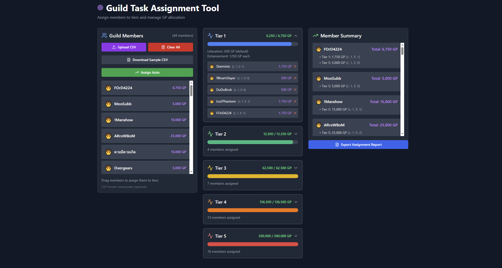

# Guild Task Assignment Tool



A web app for assigning guild members to each Tier with automatic GP calculation, built with React + Vite + TailwindCSS.

## Features

- Add/upload guild members from a CSV file
- Drag and drop members to assign them to different Tiers
- Set the number of Enhancements per member
- Automatic GP calculation and total display
- Export assignment report as a CSV file

## Getting Started

### 1. Clone the project

```sh
git clone https://github.com/FordenHillson/guild-task-assignment.git
cd guild-task-assignment
```

### 2. Install dependencies

```sh
npm install
```

### 3. Start the development server

```sh
npm run dev
```

Open your browser at [http://localhost:5173](http://localhost:5173)

### 4. Build for production

```sh
npm run build
```

The production files will be generated in the `dist/` folder.

### 5. Example CSV file for uploading members

```csv
name,avatar
John,🧑
Jane,👩
Mike,👨
Sarah,👱
Tom,🧔
```

## Customization

- Edit Tier or GP settings in [`src/TaskAssignmentTool.jsx`](src/TaskAssignmentTool.jsx)
- Customize styles in [`src/index.css`](src/index.css) and [`tailwind.config.js`](tailwind.config.js)

## Requirements

- Node.js version 18 or higher
- npm

## License

MIT
